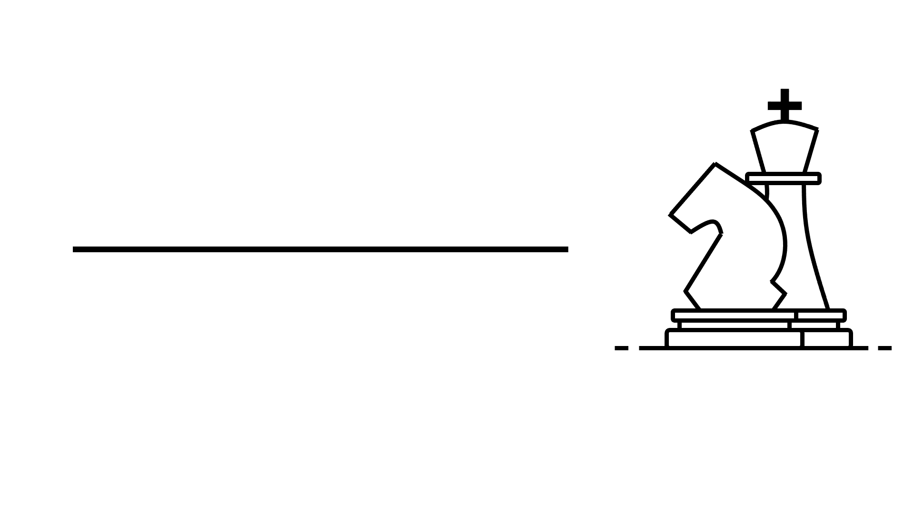

<figure>
    <p align="center">
    
    </p>
  <figcaption align = "center"></figcaption>
</figure>

# 📒 Description
<figure>
    <p align="center">
    
    </p>
  <figcaption align = "center"></figcaption>
</figure>

VSCode is an extensible editor with great customization and flexibility.  However, this can cause issues when the editor falls into a corrupted state due to extension modifications, user settings, or even version upgrades.  

This repo provides a VSCode imager that will make an image of your VSCode settings so that you can always restore back to a previous working state.

It is recommended that you first setup VSCode to be working prior to using this imager.  Once you image your working VSCode state, you can use the image to restore it back to this working state in the future.

# 🛠️ Installation
python >=3.10

```console
poetry install
```

# 📔 Usage

The Command Line Interface (CLI) can be access via:
```console
python src/main.py -h
```

To create a new image simply type:
```console
python src/main.py create-image     # will create a new image tagged by month/day/year
```

To restore your VsCode image simply type:
```console
python src/main.py restore-image <image_path>    # will restore an image tagged by path
```

# ♾️ Continuous Integration (CI) Tools
Several CI tools have been included with this codex:

* **coverage**: provides code coverage analysis
* **pdoc**: automatic documentation software
* **scalene**: profiler for evaluating performance

The `noxfile.py` provides an example of how to run each of these.  The `src/ci` folder contains common CI modules.  For an explaination on how to properly setup multiple versions of Python to run with Nox see [here](https://sethmlarson.dev/nox-pyenv-all-python-versions).

# 🔧 Troubleshooting
You cannot have VSCode open when attempting to create an image because there are certain files that the program opens and locks.  If VSCode is open while using this imager you will likely see an error that states:

```error
"[Errno 102] Operation not supported on socket: '.../Library/Application Support/Code/1.84-main.sock'"
```

The recommended way to use this CLI is through a terminal.
